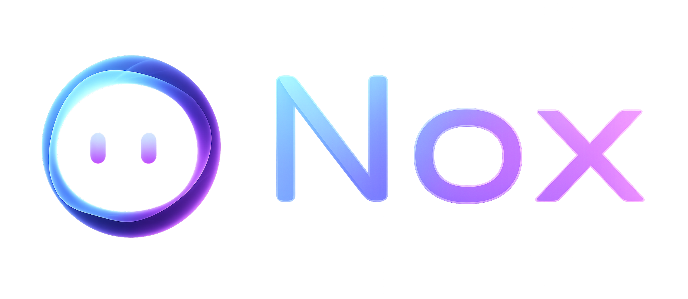
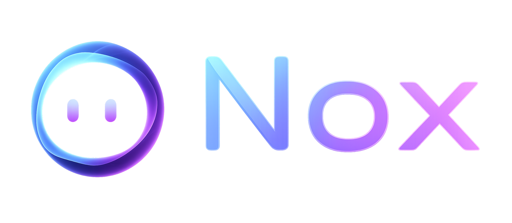

<div align="center">



**Local AI Desktop Assistant for Windows — Voice-enabled, private, and fully offline.**

<p>
  <a href="https://github.com/VeridonNetzwerk/Nox/blob/main/LICENSE">
    
  </a>
  <a href="https://github.com/VeridonNetzwerk/Nox/issues">
    
  </a>
  <a href="https://github.com/VeridonNetzwerk/Nox/stargazers">
    
  </a>
  <a href="https://github.com/VeridonNetzwerk/Nox/actions">
    
  </a>
  <a href="https://veridonnetzwerk.github.io/Nox/">
    
  </a>
  
  
  
  
</p>

</div>

---

## ✨ Features

| Feature | Description |
|---------|-------------|
| 🎙️ **Wake Word** | Say **"Hey Nox"** to activate — custom-trained openWakeWord model, fully offline |
| 🗣️ **Speech-to-Text** | GPU-accelerated transcription via faster-whisper (CUDA) with VAD silence detection |
| 🔊 **Text-to-Speech** | Multi-engine voices: Edge TTS (cloud), Kokoro-82M (offline), Piper TTS (offline fallback) — 27 languages, male & female voices |
| 💬 **Chat** | Streaming token-by-token responses via Ollama (Gemma, Llama, Mistral, etc.) |
| 👁️ **Context Capture** | Reads active windows, UI elements, clipboard, and screenshots (OCR) for context-aware answers |
| 📁 **File Search** | Indexes and searches local documents (txt, md, docx, pdf) with semantic embeddings |
| � **Music Recognition** | Identifies songs playing on your PC via system audio loopback + AudD API |
| � **Overlay UI** | Sleek always-on-top overlay with system tray, global hotkey, and dark theme |
| 🔒 **100% Local** | No cloud, no telemetry, no data leaves your machine |
| 🌐 **Multilingual** | 27 languages with auto-switching TTS voices and full i18n UI support |

---

## 🛠️ Requirements

| Component | Version | Notes |
|-----------|---------|-------|
| OS | Windows 10/11 | Windows 10 build 19041+ or Windows 11 |
| Node.js | 20+ (LTS) | For development only |
| Python | 3.11+ | For development only |
| Ollama | any recent | Local LLM runtime — auto-installed by onboarding wizard |
| GPU | NVIDIA CUDA (optional) | CPU fallback available (slower STT/OCR) |

> **Note**: Nox runs entirely locally. You don't need an internet connection after installation — all AI models (LLM, STT, TTS, wake word) run on your machine.

### 🎯 Smart Model Selection

Nox automatically selects the best Ollama model based on your GPU's VRAM. **Gemma 4** models are preferred for their strong context support, multimodal (image) capabilities, and agentic workflows.

| GPU VRAM | Schnell | Balance | Qualität |
|----------|---------|---------|----------|
| < 8 GB | Gemma 4 E2B | Gemma 4 E4B | Gemma 4 E4B |
| 8–12 GB | Gemma 4 E2B | Gemma 4 E4B | Gemma 4 26B MoE |
| 12–20 GB | Gemma 4 E2B | Gemma 4 E4B | Gemma 4 26B MoE |
| ≥ 20 GB | Gemma 4 E4B | Gemma 4 26B MoE | Gemma 4 31B |

If no Gemma model is installed, Nox falls back to any available model with a matching size, or the first available model as a last resort. You can always switch models in **Settings**.

---

## 🚀 Quick Start

### Option A: Installer (Recommended)

1. Download the latest `Nox-Setup.exe` from [Releases](https://github.com/VeridonNetzwerk/Nox/releases) or from the [Actions artifacts](https://github.com/VeridonNetzwerk/Nox/actions)
2. Run the installer — Windows SmartScreen may warn (unsigned installer), click **More info → Run anyway**
3. Nox launches and the onboarding wizard guides you through:
   - Ollama installation (if not already installed)
   - Model selection (e.g. `llama3.1`)
   - Microphone & audio device setup
   - Wake word calibration ("Hey Nox")
4. Done — start chatting or say **"Hey Nox"**

### Option B: Build from Source

```bash
git clone https://github.com/VeridonNetzwerk/Nox.git
cd Nox/nox-app

# Install dependencies
npm install
cd ui && npm install && cd ..
cd backend && python -m venv .venv && .venv\Scripts\activate && pip install -r requirements.txt && cd ..

# Start Ollama (separate terminal)
ollama serve

# Run dev environment
npm run dev
```

This starts:
- **Backend**: FastAPI on `127.0.0.1:8420` (with hot-reload)
- **Frontend**: Vite dev server + Electron

---

## 🖼️ Screenshots & Website

<div align="center">



</div>

Visit the project website: **[veridonnetzwerk.github.io/Nox](https://veridonnetzwerk.github.io/Nox/)**

---

## 🏗️ Architecture

```
nox-app/
├── ui/                    # Electron + React + Tailwind frontend
│   ├── electron/          # Main process, tray, hotkey, IPC
│   └── src/               # React app, components, locales
├── backend/               # Python FastAPI backend
│   ├── main.py            # API entry point
│   ├── nox_voice/         # Wake word → VAD → STT → TTS pipeline
│   ├── nox_eye/           # Context capture (window, UIA, OCR, clipboard)
│   ├── nox_files/         # Local file search & indexing
│   ├── orchestrator/      # Central coordination, conversation memory, tools
│   └── config.yaml        # Default config
├── assets/                # Branding & icons
└── .github/workflows/     # CI/CD — automated Windows builds
```

### Tech Stack

| Layer | Technology |
|-------|-----------|
| Frontend | Electron 33, React 18, Tailwind CSS 3, Vite 6 |
| Backend | Python 3.11, FastAPI, uvicorn |
| LLM | [Ollama](https://ollama.com) (Gemma 4 preferred, auto-selected by VRAM) |
| Wake Word | [openWakeWord](https://github.com/dscripka/openWakeWord) (custom "Hey Nox" ONNX model) |
| STT | [faster-whisper](https://github.com/SYSTRAN/faster-whisper) (CTranslate2, CUDA) |
| TTS | [Edge TTS](https://github.com/rany2/edge-tts) (cloud), [Kokoro-82M](https://github.com/hexgrad/kokoro) (offline), [Piper TTS](https://github.com/rhasspy/piper) (offline fallback) |
| VAD | [webrtcvad](https://github.com/wiseman/py-webrtcvad) (voice activity detection + end-of-turn) |
| Context | [EasyOCR](https://github.com/JaidedAI/EasyOCR), [sentence-transformers](https://github.com/UKPLab/sentence-transformers), SQLite + FTS5 |
| Music Recognition | [AudD](https://audd.io) API + [SoundCard](https://github.com/bastibe/SoundCard) (WASAPI loopback) |
| Packaging | [electron-builder](https://github.com/electron-userland/electron-builder) (NSIS installer) |

---

## ⚙️ Configuration

Settings are stored in `%APPDATA%\Nox\config.yaml` and can be changed via the in-app Settings panel:

| Setting | Default | Description |
|---------|---------|-------------|
| `wake_word_enabled` | `true` | Enable "Hey Nox" voice activation |
| `wake_word_model` | `hey_nox.onnx` | Wake word ONNX model filename |
| `wake_word_threshold` | `0.5` | Detection sensitivity (0–1) |
| `stt_model` | `small` | Whisper model size (tiny/base/small/medium/large) |
| `stt_language` | `de` | STT language code |
| `stt_device` | `cuda` | Compute device (cuda/cpu) |
| `tts_model` | `de-DE-SeraphinaMultilingualNeural` | TTS voice ID (Edge/Kokoro/Piper) |
| `tts_engine` | `edge` | TTS engine: edge, kokoro, or piper |
| `vad_silence_duration` | `1.0` | Silence seconds to end recording |
| `vad_timeout` | `15.0` | Max recording duration |
| `hotkey` | `Ctrl+Shift+Space` | Global overlay toggle |

### Data Storage

| Path | Content |
|------|---------|
| `%APPDATA%\Nox\config.yaml` | Configuration |
| `%APPDATA%\Nox\logs\` | Rotated log files |
| `%APPDATA%\Nox\data\nox.db` | SQLite: context + conversations |

---

## 🔨 Build & CI

### Local Build

```bash
cd nox-app
npm run build
```

This runs three steps:
1. **build:backend** — Downloads Python 3.11.9 embeddable, installs all pip packages, copies backend source
2. **build:ui** — Vite production build of the React frontend
3. **electron-builder** — Packages everything into a NSIS installer

Output: `dist/Nox-Setup-0.5.0.exe`

### GitHub Actions

Every push to `main` triggers an automated build on `windows-latest`:

[](https://github.com/VeridonNetzwerk/Nox/actions)

Artifacts are available for download from the [Actions tab](https://github.com/VeridonNetzwerk/Nox/actions):
- **Nox-Installer** — NSIS `.exe` installer
- **Nox-Unpacked** — Unpacked portable version

---

## 📖 Documentation

| Document | Description |
|----------|-------------|
| [Architecture](nox-app/ARCHITECTURE.md) | Full architecture and component overview |
| [Dev Setup](nox-app/README.md) | Detailed development setup guide |
| [Test Plan](nox-app/Testplan.md) | Manual end-to-end test scenarios |

---

## 🐛 Reporting Issues

Found a bug? Open an [**Issue**](https://github.com/VeridonNetzwerk/Nox/issues/new) and include:

- What you expected vs. what actually happened
- Your Windows version and GPU (NVIDIA/AMD/Intel)
- Whether you're using the installer or running from source
- Any relevant log output from `%APPDATA%\Nox\logs\`

---

## 💖 Support

If you like this project, consider donating:

<a href="https://www.paypal.com/donate/?hosted_button_id=972P9WTWE7RBU">
  
</a>

---

## 🙏 Credits & Built With

Nox stands on the shoulders of these amazing open-source projects:

| Project | Role |
|---------|------|
| [Ollama](https://ollama.com) | Local LLM runtime — powers all chat and reasoning (Gemma 4) |
| [faster-whisper](https://github.com/SYSTRAN/faster-whisper) | GPU-accelerated speech-to-text transcription |
| [Piper TTS](https://github.com/rhasspy/piper) | Offline neural text-to-speech (fallback engine) |
| [Edge TTS](https://github.com/rany2/edge-tts) | Microsoft Edge cloud text-to-speech voices |
| [Kokoro-82M](https://github.com/hexgrad/kokoro) | Lightweight offline TTS with 27-language support |
| [openWakeWord](https://github.com/dscripka/openWakeWord) | Offline wake word detection |
| [webrtcvad](https://github.com/wiseman/py-webrtcvad) | Voice activity detection |
| [EasyOCR](https://github.com/JaidedAI/EasyOCR) | OCR for screen text extraction |
| [sentence-transformers](https://github.com/UKPLab/sentence-transformers) | Semantic embeddings for context & file search |
| [FastAPI](https://fastapi.tiangolo.com) | Backend API framework |
| [Electron](https://www.electronjs.org) | Cross-platform desktop UI runtime |
| [React](https://react.dev) | Frontend UI library |
| [Tailwind CSS](https://tailwindcss.com) | Utility-first CSS framework |
| [SoundCard](https://github.com/bastibe/SoundCard) | System audio loopback capture for music recognition |
| [AudD](https://audd.io) | Music recognition API |

### 🤖 Built With AI

Parts of this project were created and refined with the assistance of AI tools.

---

<div align="center">
  <sub>© 2026 VeridonNetzwerk</sub>
</div>
